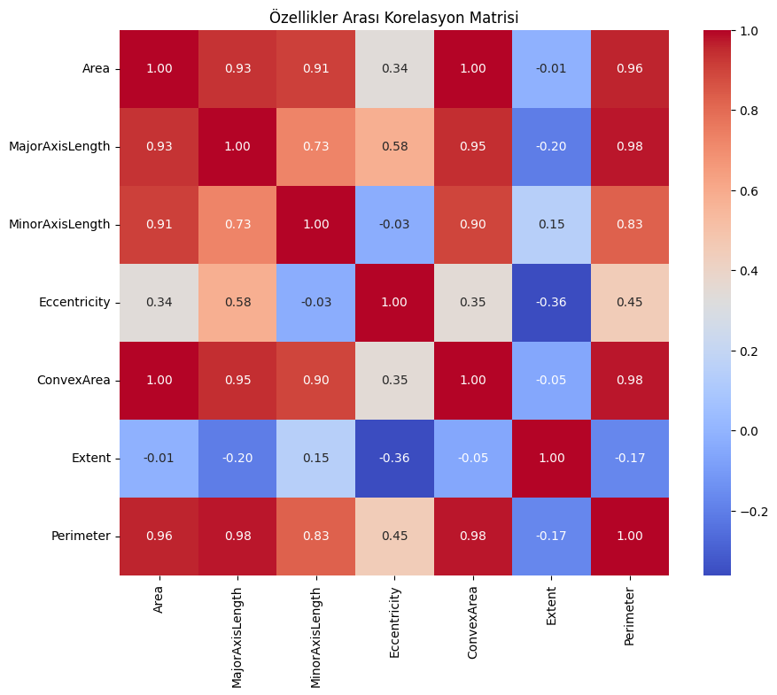
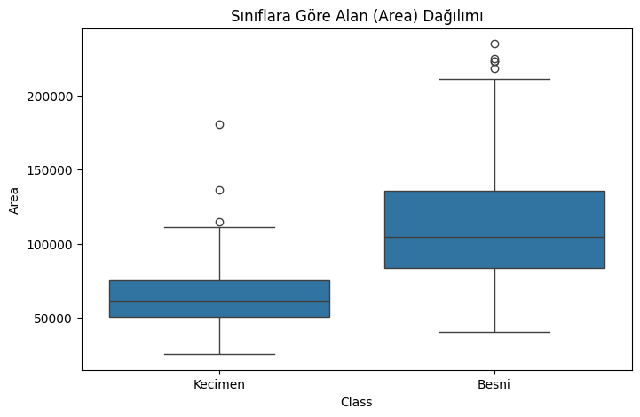
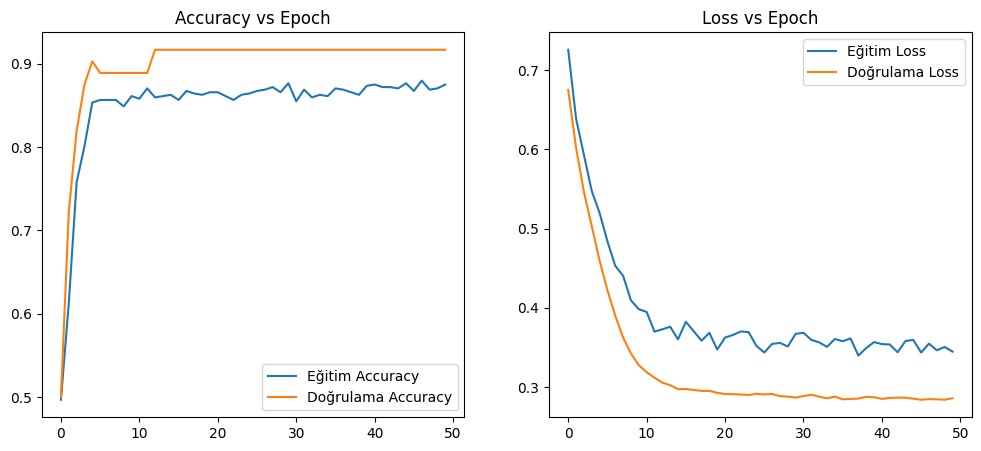
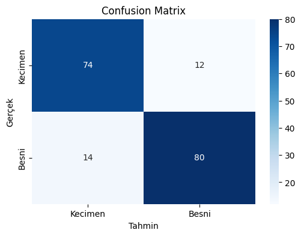

# Yapay Sinir Ağları ile Kuru Üzüm Türlerinin Sınıflandırılması
### (Raisin Dataset Classification using Neural Networks)

Bu proje, **Selçuk Üniversitesi Fen Bilimleri Enstitüsü Bilgisayar Mühendisliği ABD - Hesaplamalı Zeka Dersi Final Projesi** kapsamında geliştirilmiştir. Projenin amacı, görüntü işleme teknikleriyle morfolojik özellikleri çıkarılmış kuru üzüm türlerini (Kecimen ve Besni) en yüksek doğrulukla sınıflandırabilen bir Yapay Sinir Ağı (YSA) modeli tasarlamaktır.

## 📌 Proje Özeti
* **Veri Seti:** Raisin Dataset (UCI Machine Learning Repository)
* **Örnek Sayısı:** 900 (450 Kecimen, 450 Besni - Dengeli Dağılım)
* **Giriş Özellikleri (7 Adet):** Area, Perimeter, MajorAxisLength, MinorAxisLength, Eccentricity, ConvexArea, Extent
* **Çıkış Sınıfı (1 Adet):** Class (Kecimen: 0, Besni: 1)
* **Kullanılan Teknolojiler:** Python, TensorFlow, Keras, Pandas, NumPy, Scikit-learn, Seaborn, Matplotlib

## 🛠️ Model Mimarisi & Hiperparametreler
Geliştirilen Derin Sinir Ağı (DNN) modeli, aşırı öğrenmeyi (overfitting) engelleyen katmanlar ve ileri beslemeli bir yapı barındırmaktadır:

* **Giriş Katmanı:** 7 morfolojik özellik
* **1. Gizli Katman:** 16 Nöron + ReLU Aktivasyon Fonksiyonu
* **2. Gizli Katman:** 8 Nöron + ReLU Aktivasyon Fonksiyonu
* **Regülasyon:** Dropout (%20)
* **Çıkış Katmanı:** 1 Nöron + Sigmoid Aktivasyon Fonksiyonu
* **Optimizer:** Adam
* **Loss Fonksiyonu:** Binary Crossentropy
* **Epoch / Batch Size:** 50 Epoch / 32 Batch

## 📊 Elde Edilen Sonuçlar

Modelimiz test veri seti üzerinde **%86 genel doğruluk (Accuracy)** oranına ulaşmıştır. Sınıflara ait detaylı performans metrikleri aşağıdadır:

| Sınıf | Precision | Recall | F1-Score |
| :--- | :---: | :---: | :---: |
| **Kecimen** | 0.84 | 0.86 | 0.85 |
| **Besni** | 0.87 | 0.85 | 0.86 |
| **Genel Ortalama** | **0.86** | **0.86** | **0.86** |

### Proje Görselleri

#### 1. Keşifçi Veri Analizi (EDA) Grafikleri
Model eğitiminden önce verilerin yapısını anlamak adına çıkarılan grafikler aşağıda sunulmuştur:

<p align="center">
  
  
</p>

#### 2. Model Eğitim ve Sınıflandırma Performansı
YSA modelinin 50 epoch boyunca eğitim geçmişi ve test seti üzerindeki başarı sonuçları:

<p align="center">
  
</p>

<p align="center">
  
</p>

* **Confusion Matrix:** Model 180 test örneğinden 154 tanesini tamamen doğru sınıflandırmıştır.
* **Loss/Accuracy Grafik Yapısı:** İlk 15 epoch içerisinde hızlıca yakınsayan model, eğitim ve doğrulama süreçlerinde paralel ve kararlı bir grafik sergilemiştir.

## 🚀 Projeyi Yerelde Çalıştırma

1. Bu depoyu klonlayın:
   ```bash
   git clone [https://github.com/abdullah-altunkaynak/raisin-classification-nn.git](https://github.com/abdullah-altunkaynak/raisin-classification-nn.git)
